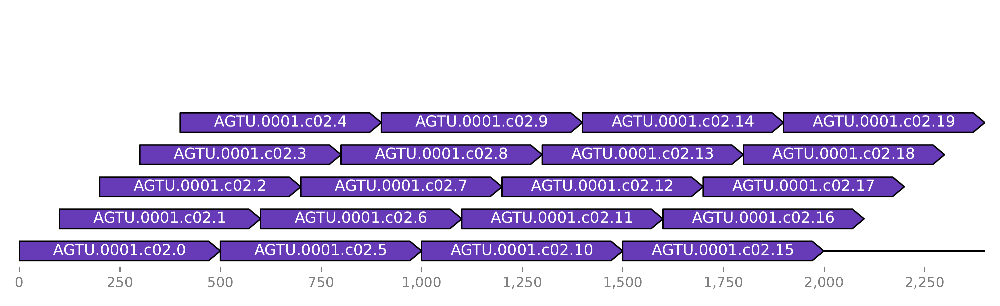

# Insertion detection for haploid genomes

This package identifies and annotates large insertions in evolved bacterial strains. The underlying approach is very simple making it reliable and fast. The genome of the ancestral strain and the annotated genome of the mutated strains are inputted. The two genomes are aligned and insertions detected. The output includes the inserted products and positions in the mutated strain. To help verifying the deletions, alignment plots are generated optionally.
Because of it's simple design, this package only takes about 2 minutes to process even when run locally.
This package was developed with assemblies generated with PacBio data. It's recommended to use high-quality assemblies only, derived ether from PacPio data or hybrid-assembled Nanopore and Illumina data.

## Installation 

This package requires `SAMtools>=1.11` and `minimap2` in your PATH.  
The package itself can be installed using pip.
```
git clone https://github.com/nahanoo/insertion_detection.git
cd insertion_detection
pip install .
```
Pip will create a console script for you called `detect_insertions` which will be callable outside the project folder.

## Usage

`detect_insertions -h`
```
usage: detect_insertions [-h] [--plot] ancestral mutant out_dir

Detect insertions in evolved bacterial strains.

positional arguments:
  ancestral   fasta file of the ancestral strain
  mutant      genbank file of the mutated strain
  out_dir     output directory

optional arguments:
  -h, --help  show this help message and exit
  --plot      if this flag is added the alignment of every insertion is plotted
```

## Background

The genome of ancestral strain is chunked into smaller sequences using a sliding window approach. In detail, the genome is chunked into 500 base-pair chunks with with a start position shift of 100 base-pairs.
Below you can see the alignment of such chunks against itself:

The id of the sequence consists of the contig name and the enumerated step count.
These chunks of the ancestral strain are then aligned to the mutated genome. Below you can see such an alignment at a position with no coverage. This plot is outputted if you add `--plot` flag.

As you can see there is a gap in the alignment. At this position the sequence is only present in the mutated strain but missing in the ancestral strain, therfore the sequence was inserted in the mutated strain. 

## Outputs

`insertions.tsv` contains the positions and lenghts of the inserted sequences in the mutated strain.  
`insertions.tsv` contains and additional column called `product` storing which products were inserted.  
Plots are stored in the `plots` directory. In the `alignemtns` sub-folder you find the alignments of the chunked sequences to the ancestral genome in identified regions with no coverage. There is also a visualization of the deleted products which is stored in the `annotation` sub-folder.