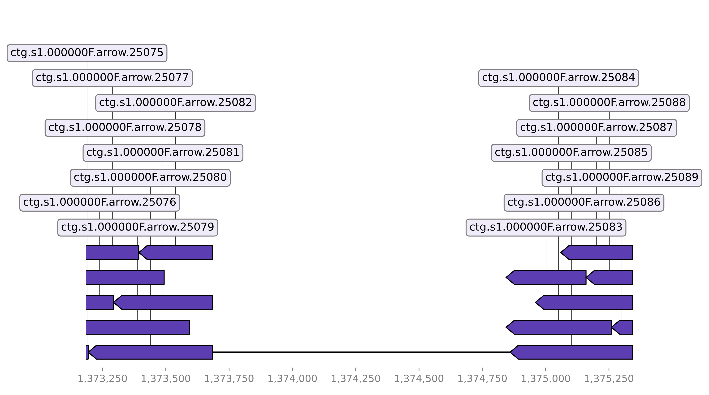

# Deletion Detection

## Principle

To detect deletions StrucFollower chunks the genome of the mutated strain into smaller chunks. These chunks are aligned to the ancestral genome. The alignment is scanned for areas with no coverage. In areas with no coverage the given sequence is present in the genome of the ancestral strain but absent the genome of the mutated strain.
In order to find the positions of the deleted sequences in the genome of the mutated strain, the area around the identified sequence in the genome of the ancestral strain is extracted and aligned to the genome of the mutated strain. Based on this alignment the positions in the genome of the mutant are identified.

## Usage

```
usage: detect_deletions [-h] [--plot] ancestral mutant out_dir

Detect deletions in evolved bacterial strains.

positional arguments:
  ancestral   genbank file of the ancestral strain
  mutant      fasta file of the mutated strain.
  out_dir     output directory

optional arguments:
  -h, --help  show this help message and exit
  --plot      plots alignment around regions of deletions
```

Example:
```
detect_deletions --plot ancestral.gbk mutant.fasta ./
```

## Outputs

* `no_coverage.tsv` - Outputs all positions with no coverage in the genome of the ancestral strain. 
* `deletions.tsv` - Outputs all deleted sequences containing the positions in the genome of the mutated strain (`chromosome` and `position`) and the ancestral strain (`chromosome_origin` and `position_origin`).  
* `deletions.annotated.tsv` - Stores additionally which products were deleted. 
* `plasmids.tsv` - Outputs entirely deleted plasmids.
* `plasmids.annotated.tsv` - Stores additionally which products were located on the plasmids
* `plots` - Optional output.
    * `alignments` - Visualizes alignments of areas located in `no_coverage.tsv`. 
    * `annotations` - Visualizes the annotation of the deleted sequence.

Visualization of a detected deletion

The base-track is the genome of the ancestral strain and the aligned sequences chunks of the genome of the mutated strain.
The ID of the chunk consists of the contig name and the enumerated counter of the chunk. As you you can see the highest counter on the left side of the gap is 25082. The counter is continued on the right side with 25083. This continuity ensures us that the gap in the alignments is due to a deleted sequence. In this example we can say pretty confidently that we identified a deleted sequence. If the counters wouldn't be continuous or even come from different contigs the confidence would be lower.