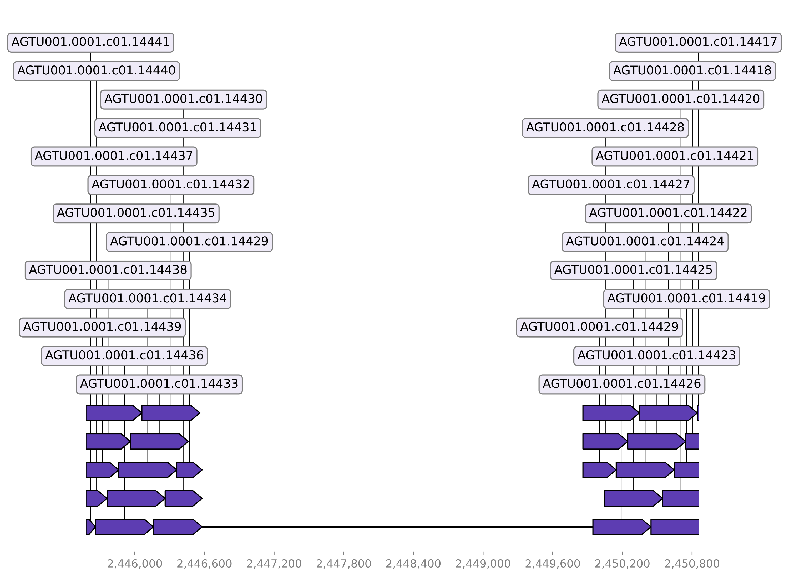

# Detect deletions

## Alignment and detection

To detect deletions StrucFollower chunks the genome of the mutant into smaller chunks. Those chunks are aligned to the genome of the ancestor and the alignment is scanned for areas with no coverage. In areas with no coverage the given sequence is present in the ancestor but absent in the mutant.  
The sequence flanking the alignment gap in the ancestor is extracted and aligned back to the genome of the mutant. Based on this alignment the positions in the genome of the mutant are identified.

## Usage

```
usage: detect_deletions [-h] [--plot] mutant ancestral out_dir

Detect deletions in evolved bacterial strains.

positional arguments:
  mutant      fasta file of the mutated strain.
  ancestral   genbank file of the ancestor
  out_dir     output directory

optional arguments:
  -h, --help  show this help message and exit
  --plot      plot alignments and annotations
```

Example:
```
detect_deletions --plot ancestor.gbk mutant.fasta ./
```

## Outputs

* `no_coverage.tsv` - Outputs all positions with no coverage in the genome of the ancestor. 
* `deletions.tsv` - Outputs all deleted sequences containing the positions in the genome of the mutant (`chromosome` and `position`) and the ancestor (`chromosome_origin` and `position_origin`).  
* `deletions.annotated.tsv` - Stores additionally which products were deleted. 
* `plasmids.tsv` - Outputs entirely deleted plasmids.
* `plasmids.annotated.tsv` - Stores additionally which products were located on the deleted plasmids
* `plots` - Optional output.
    * `alignments` - Visualizes alignments used to detect the deleted sequences.
    * `annotations` - Visualizes the annotations of the deleted sequences.

## Plots

Below you can see an example of a plotted alignment for a detected deleted sequence:

The base track is the genome of the ancestor. The aligned sequences are derived from the mutant. The gap in the alignment means that the sequence is only present in the ancestor.
Because of the continuos counters of the enumerated chunk IDs we can tell that the quality of the alignment is high. This increases the confidence in the detected deletion.