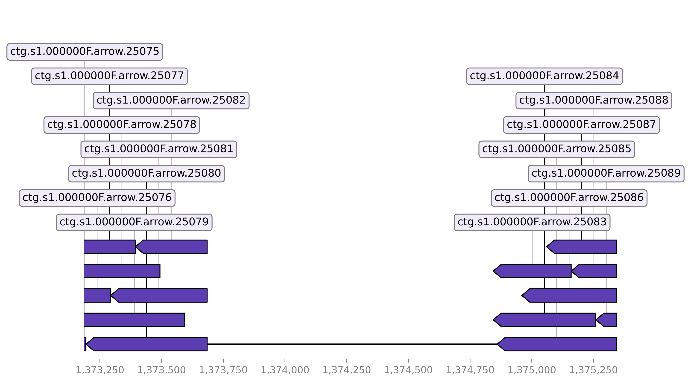

# Detect insertions

## Alignment and detection

To detect insertions StrucFollower chunks the genome of the ancestor into smaller chunks. Those chunks are aligned to the genome of the mutant and the alignment is scanned for areas with no coverage. In areas with no coverage the given sequence is present in the genome of the mutant but absent the genome of the ancestor.

## Usage

```
usage: detect_insertions [-h] [--plot] ancestral mutant out_dir

Detect insertions in evolved bacterial strains.

positional arguments:
  ancestral   fasta file of the ancestor
  mutant      genbank file of the mutant
  out_dir     output directory

optional arguments:
  -h, --help  show this help message and exit
  --plot      plot alignments and annotations
```

Example:
```
detect_insertions --plot ancestor.fasta mutant.gbk ./
```

## Outputs

* `insertions.tsv` - Outputs all positions with inserted sequences
* `insertions.annotated` - Additionally outputs which products were inserted
* `plots` - Optional
    * `alignments` - Visualizes alignments used to detect the inserted sequences.
    * `annotations` - Visualizes the annotations of the inserted sequences.

## Plots

Below you can see an example of a plotted alignment for a detected inserted sequence:

The base track is the genome of the mutant. The aligned sequences are derived from the ancestor. The gap in the alignment means that the sequence is only present in the mutant.
Because of the continuos counters of the enumerated chunk IDs we can tell that the quality of the alignment is high. This increases the confidence in the detected insertion.