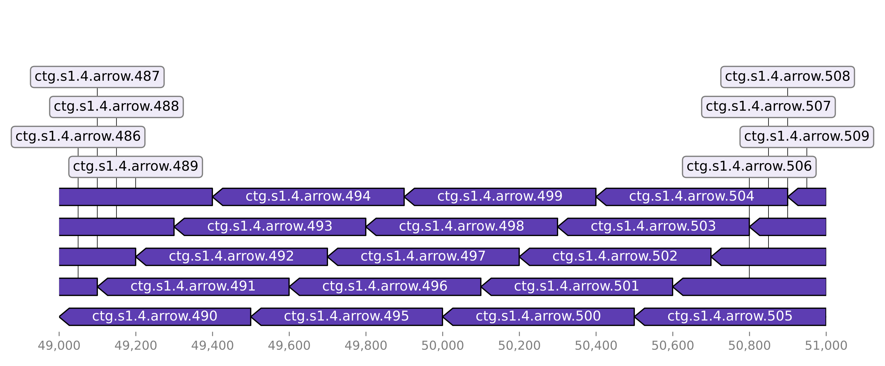

# Welcome to SeqFollower

## Introduction

This package helps you to identify deleted or inserted sequences in evolved bacterial strains.  
For example if you evolved antibiotic resistance to a bacterial strain this package helps you to identify sequences which were integrated or deleted during evolution. With its support for GenBank files SeqFollower also tells you which products were inserted or deleted. SeqFollower optionally generates visualizations of alignments from which the inserted or deleted sequences were detected which helping in assessing the confidence of the detected sequences.  

If you evolved your bacterial strain with other bacterial strains in co-culture SeqFollower has a feature which identifies horizontal gene transfers (HGTs).

This package has very few dependencies and because of the simple design it's fast and reliable.  
Every sub-module takes less than 2 minutes to run locally.

## Installation

This package requires `SAMtools>=1.11` and `minimap2` in your PATH. If you haven't installed those dependencies already you can install them with `conda`:

```
conda install -c bioconda samtools
conda install -c bioconda minimap2 
```

SeqFollower itself can be installed with pip:
```
pip install git+https://github.com/nahanoo/SeqFollower.git
```

SeqFollower creates three console scripts which are independently callable. Click on the console script name for the detailed documentation of the sub-module. 

* [`detect_deletions`](detect_deletions) - Detects deleted sequences.  
* [`detect_insertions`](detect_insertions) - Detects inserted sequences.  
* [`detect_hgts`](detect_hgts) - Detects horizontal gene transfers.

## Input data

SeqFollower was developed and tested with PacBio long-read sequencing data and it's recommended to use high-quality assemblies. As an alternative to PacBio assemblies, hybrid-assemblies with Nanopre and Illumina data should work as well.

## Principle

All three sub-modules have a similar mechanism. As an input the GenBank or the FASTA file of the ancestral strain (ancestor) and the mutated strain (mutant) are required. 
To detect HGTs the FASTA files of the other bacterial strains of the co-culture are required additionally.  

Depending on the sub-module either the genome of the ancestor or the mutant is chunked into smaller sequences using a sliding window. Typically a window size of 500 base-pairs and a start-shift of 100 base-pairs is used. Below you can see an example of chunked sequences aligned to the genome itself:


*The sequence name consists of the contig name and an enumerated counter of the chunk. This helps us in investigating deleted or inserted sequences with the generated visualizations.*  

Those chunks are then aligned either to the ancestor, mutant or the references of the strains from the co-culture using `minimap2`.  
A detailed description of the alignment process is available in the different sub-module documentations.  

Optionally, the alignments which were used to detect the deleted or inserted sequences are plotted which can help in assessing the quality of the detections. More information about how to interpret those alignment plots is available in the different sub-module documentations.

## Contributing

The development of SeqFollower takes place on [GitHub](https://github.com/nahanoo/SeqFollower).  
Head over there if you are interested in the code or want to contribute to the project.