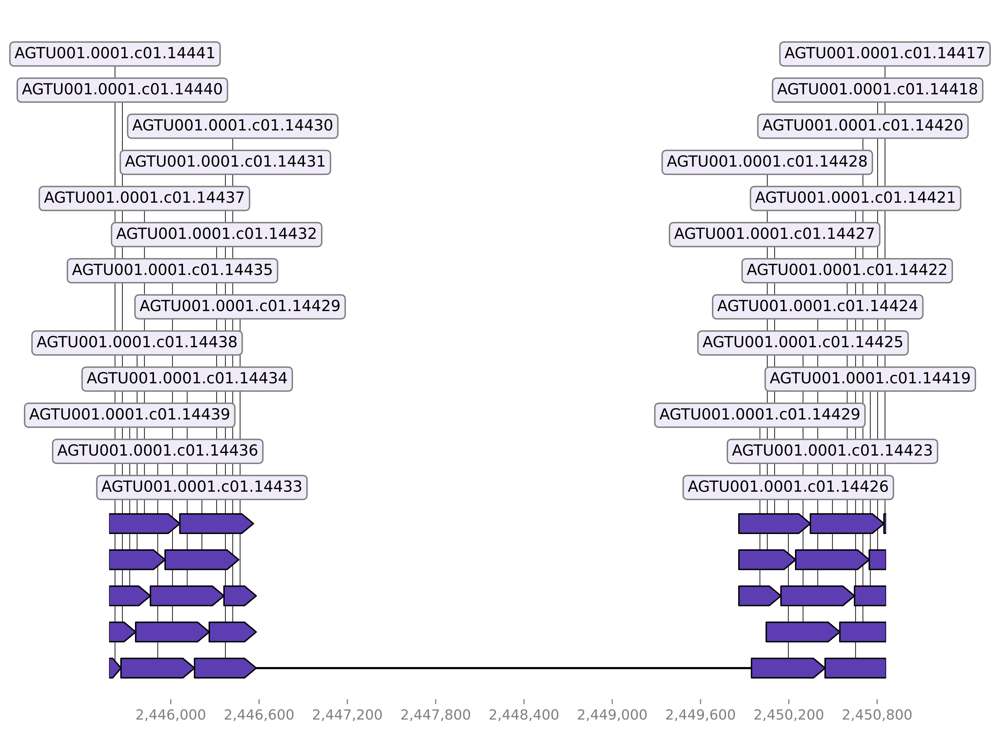

Below you can see an example of an alignment for a detected insertion where the chunked genome of the mutant was aligned to the genome of the ancestor.

The gap in the alignment means that the sequence is only present in the mutant but not in the ancestor. Because of the continous counters visible in the sequence names we can see that the inserted sequence is flanked by high-quality alignments which increases the confidence in the detected insertion.